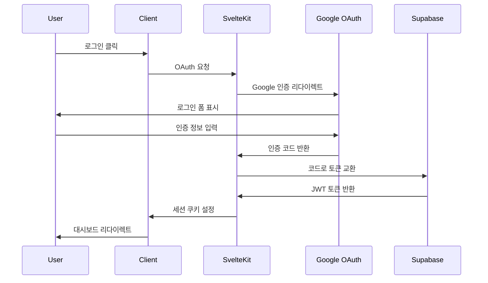
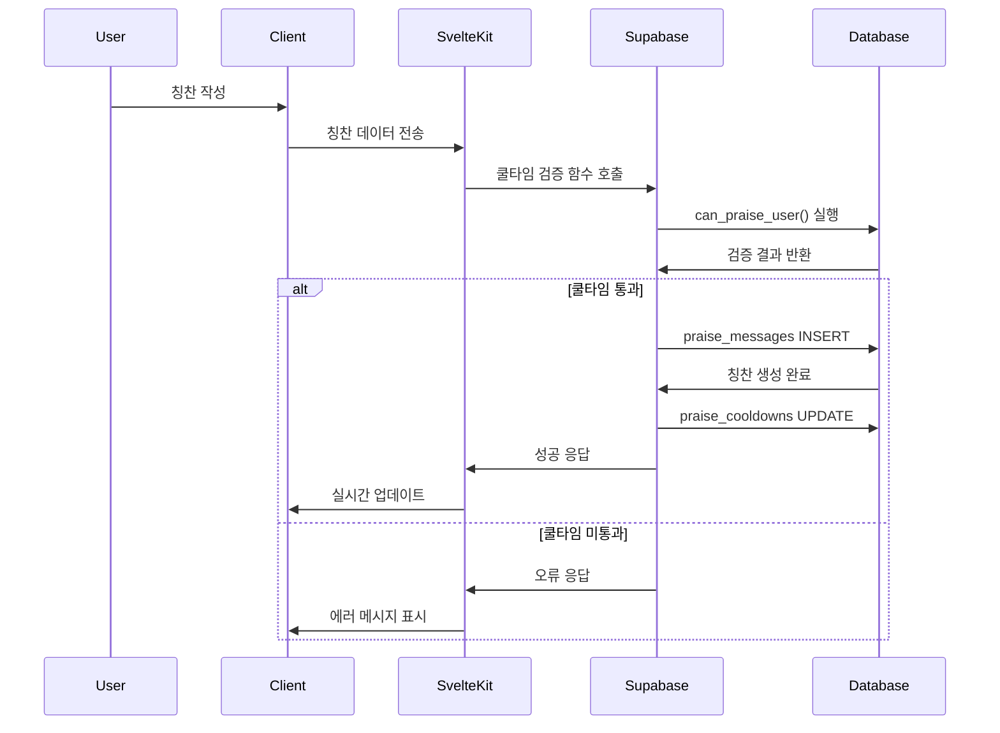

# 시스템 아키텍처

Cheer Messenger의 전체 시스템 아키텍처와 기술적 설계를 설명합니다.

## 🏗️ 전체 아키텍처

```
┌─────────────────┐    ┌─────────────────┐    ┌─────────────────┐
│   Client        │    │   SvelteKit     │    │   Supabase      │
│   (Browser)     │◄──►│   Frontend      │◄──►│   Backend       │
└─────────────────┘    └─────────────────┘    └─────────────────┘
         │                       │                       │
         │                       │                       │
         ▼                       ▼                       ▼
┌─────────────────┐    ┌─────────────────┐    ┌─────────────────┐
│   UI Components │    │   Server Actions│    │   Database      │
│   Svelte/TS     │    │   API Routes    │    │   PostgreSQL    │
└─────────────────┘    └─────────────────┘    └─────────────────┘
```

## 🎯 아키텍처 원칙

### 1. **프론트엔드 중심 설계**
- SvelteKit의 풀스택 기능 활용
- SSR/SPA 하이브리드 렌더링
- 컴포넌트 기반 모듈화

### 2. **Backend-as-a-Service**
- Supabase를 통한 서버리스 백엔드
- 실시간 데이터베이스 구독
- 자동 API 생성

### 3. **보안 우선 설계**
- Row Level Security (RLS) 정책
- 클라이언트-서버 검증 이중화
- JWT 기반 인증

## 🔧 기술 스택

### Frontend
```typescript
├── SvelteKit 2.0      // 풀스택 프레임워크
├── TypeScript         // 타입 안전성
├── Tailwind CSS       // 유틸리티 CSS
└── Vite              // 빌드 도구
```

### Backend
```typescript
├── Supabase          // BaaS 플랫폼
├── PostgreSQL        // 데이터베이스
├── PostgREST         // 자동 API 생성
└── GoTrue            // 인증 서비스
```

### DevOps
```typescript
├── Vercel            // 배포 플랫폼
├── GitHub Actions    // CI/CD (선택)
└── ESLint/Prettier   // 코드 품질
```

## 📊 데이터 흐름

### 인증 플로우


### 칭찬 전송 플로우


## 🏛️ 레이어 구조

### 1. Presentation Layer (프레젠테이션 층)
```
src/lib/components/
├── common/           # 공통 UI 컴포넌트
├── dashboard/        # 대시보드 관련
├── group/           # 모임 관련
├── create-group/    # 모임 생성
├── invite/          # 초대 관련
└── settings/        # 설정 관련
```

**역할**:
- 사용자 인터페이스 렌더링
- 사용자 입력 처리
- 상태 관리 (Svelte stores)

### 2. Business Logic Layer (비즈니스 로직 층)
```
src/lib/utils/
├── auth.ts          # 인증 관련 로직
├── groups.ts        # 모임 관리 로직
├── members.ts       # 멤버 관리 로직
└── praise.ts        # 칭찬 시스템 로직
```

**역할**:
- 비즈니스 규칙 구현
- 데이터 변환 및 유효성 검사
- API 호출 추상화

### 3. Data Access Layer (데이터 접근 층)
```
src/lib/
├── supabase.ts      # Supabase 클라이언트
├── database.types.ts # 타입 정의
└── stores/          # 상태 관리
```

**역할**:
- 데이터베이스 연결
- 타입 안전성 보장
- 실시간 구독 관리

### 4. Database Layer (데이터베이스 층)
```sql
-- 핵심 테이블
users              # 사용자 정보
groups             # 모임 정보
group_members      # 멤버십 관계
praise_messages    # 칭찬 메시지
praise_cooldowns   # 쿨타임 추적
```

**역할**:
- 데이터 영속성
- 무결성 제약조건
- 비즈니스 로직 (함수/트리거)

## 🔐 보안 아키텍처

### 인증 체계
```
Google OAuth 2.0 → Supabase Auth → JWT Token → RLS Policy
```

### RLS 정책 구조
```sql
-- 사용자별 데이터 격리
users: auth.uid() = id

-- 모임별 데이터 접근 제한
groups: EXISTS(SELECT 1 FROM group_members WHERE user_id = auth.uid())

-- 칭찬 메시지 접근 제어
praise_messages: 모임 멤버만 조회/생성 가능
```

### 데이터 보호 전략

1. **클라이언트 측 검증**: 즉시 피드백
2. **서버 측 검증**: 보안 보장
3. **데이터베이스 제약**: 최종 방어선

## 📈 확장성 고려사항

### 성능 최적화
- **Database Indexing**: 조회 성능 향상
- **Connection Pooling**: Supabase 자동 관리
- **CDN**: Vercel Edge Network
- **Image Optimization**: 자동 압축/변환

### 모니터링 전략
- **Real-time Logs**: Supabase 대시보드
- **Error Tracking**: 브라우저 개발자 도구
- **Performance Metrics**: Core Web Vitals

### 확장 가능한 구조
```
현재: Single-tenant (모임별 격리)
확장: Multi-tenant (조직별 격리)
글로벌: Region별 데이터베이스
```

## 🚀 배포 아키텍처

### Vercel 배포 구조
```
GitHub Repository → Vercel Build → Edge Deployment
                  ↓
                Supabase Database (Regional)
```

### 환경별 구성
- **Development**: 로컬 + Supabase Dev
- **Staging**: Vercel Preview + Supabase Staging
- **Production**: Vercel Production + Supabase Production

## 🔄 실시간 기능

### Supabase Realtime
```typescript
// 실시간 칭찬 목록 업데이트
supabase
  .channel('praise_messages')
  .on('postgres_changes', {
    event: '*',
    schema: 'public',
    table: 'praise_messages'
  }, handlePraiseUpdate)
  .subscribe()
```

### 데이터 동기화 전략
1. **Optimistic Updates**: 즉시 UI 반영
2. **Real-time Sync**: 서버 변경사항 구독
3. **Conflict Resolution**: 마지막 업데이트 우선

---

이 아키텍처는 **단순함**, **확장성**, **보안성**의 균형을 추구하며, 팀의 개발 생산성과 사용자 경험을 최우선으로 설계되었습니다.