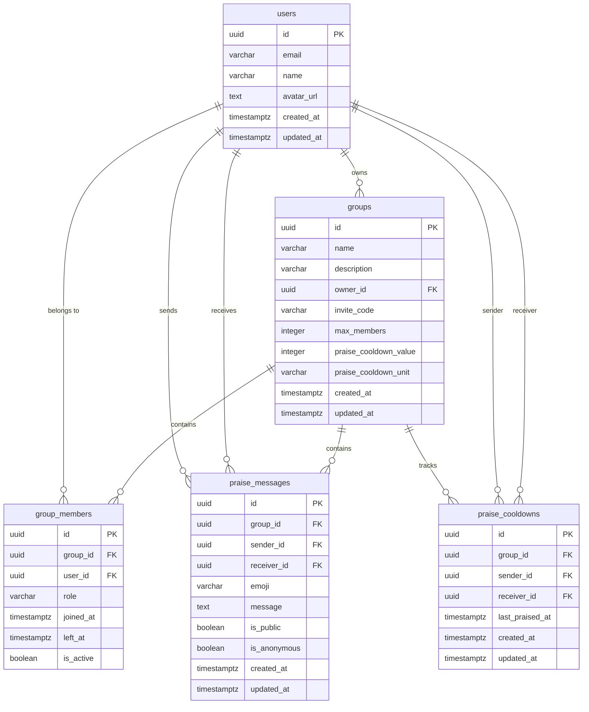

# Supabase 데이터베이스 스키마

Cheer Messenger의 완전한 데이터베이스 스키마 설계와 각 테이블의 역할을 설명합니다.

## 📊 ERD (Entity Relationship Diagram)



## 🗃️ 테이블 상세

### `users` - 사용자 정보

사용자 프로필 정보를 저장하는 테이블입니다.

```sql
CREATE TABLE users (
    id UUID PRIMARY KEY REFERENCES auth.users(id) ON DELETE CASCADE,
    email VARCHAR(255) UNIQUE NOT NULL,
    name VARCHAR(50) NOT NULL,
    avatar_url TEXT,
    created_at TIMESTAMPTZ DEFAULT NOW(),
    updated_at TIMESTAMPTZ DEFAULT NOW()
);
```

#### 필드 설명

| 필드         | 타입         | 제약조건         | 설명                    |
| ------------ | ------------ | ---------------- | ----------------------- |
| `id`         | UUID         | PK, FK           | Supabase Auth 사용자 ID |
| `email`      | VARCHAR(255) | UNIQUE, NOT NULL | 이메일 주소             |
| `name`       | VARCHAR(50)  | NOT NULL         | 사용자 이름             |
| `avatar_url` | TEXT         | NULL             | 프로필 이미지 URL       |
| `created_at` | TIMESTAMPTZ  | DEFAULT NOW()    | 생성 시간               |
| `updated_at` | TIMESTAMPTZ  | DEFAULT NOW()    | 수정 시간               |

#### 비즈니스 규칙

- Supabase Auth와 1:1 관계
- 이메일은 고유해야 함
- 사용자 이름은 50자 제한

### `groups` - 모임 정보

모임의 기본 정보와 설정을 저장하는 테이블입니다.

```sql
CREATE TABLE groups (
    id UUID PRIMARY KEY DEFAULT uuid_generate_v4(),
    name VARCHAR(100) NOT NULL,
    description VARCHAR(500),
    owner_id UUID NOT NULL REFERENCES users(id) ON DELETE CASCADE,
    invite_code VARCHAR(36) UNIQUE NOT NULL DEFAULT uuid_generate_v4(),
    max_members INTEGER DEFAULT 50 CHECK (max_members > 0 AND max_members <= 1000),
    praise_cooldown_value INTEGER DEFAULT 1 CHECK (praise_cooldown_value >= 0),
    praise_cooldown_unit VARCHAR(20) DEFAULT 'day' CHECK (praise_cooldown_unit IN ('none', 'second', 'minute', 'hour', 'day', 'week', 'month', 'year')),
    created_at TIMESTAMPTZ DEFAULT NOW(),
    updated_at TIMESTAMPTZ DEFAULT NOW()
);
```

#### 필드 설명

| 필드                    | 타입         | 제약조건             | 설명                  |
| ----------------------- | ------------ | -------------------- | --------------------- |
| `id`                    | UUID         | PK                   | 모임 고유 ID          |
| `name`                  | VARCHAR(100) | NOT NULL             | 모임 이름             |
| `description`           | VARCHAR(500) | NULL                 | 모임 설명             |
| `owner_id`              | UUID         | FK, NOT NULL         | 모임 생성자 ID        |
| `invite_code`           | VARCHAR(36)  | UNIQUE, NOT NULL     | 초대 코드 (UUID)      |
| `max_members`           | INTEGER      | DEFAULT 50, CHECK    | 최대 멤버 수 (1-1000) |
| `praise_cooldown_value` | INTEGER      | DEFAULT 1, CHECK     | 쿨타임 값             |
| `praise_cooldown_unit`  | VARCHAR(20)  | DEFAULT 'day', CHECK | 쿨타임 단위           |

#### 쿨타임 단위 옵션

- `none`: 제한 없음
- `second`: 초
- `minute`: 분
- `hour`: 시간
- `day`: 일 (기본값)
- `week`: 주
- `month`: 월
- `year`: 년

### `group_members` - 모임 멤버십

사용자와 모임 간의 멤버십 관계를 관리하는 테이블입니다.

```sql
CREATE TABLE group_members (
    id UUID PRIMARY KEY DEFAULT uuid_generate_v4(),
    group_id UUID NOT NULL REFERENCES groups(id) ON DELETE CASCADE,
    user_id UUID NOT NULL REFERENCES users(id) ON DELETE CASCADE,
    role VARCHAR(20) DEFAULT 'member' CHECK (role IN ('admin', 'member')),
    joined_at TIMESTAMPTZ DEFAULT NOW(),
    left_at TIMESTAMPTZ,
    is_active BOOLEAN DEFAULT TRUE,
    UNIQUE(group_id, user_id, is_active)
);
```

#### 필드 설명

| 필드        | 타입        | 제약조건                | 설명                |
| ----------- | ----------- | ----------------------- | ------------------- |
| `id`        | UUID        | PK                      | 멤버십 고유 ID      |
| `group_id`  | UUID        | FK, NOT NULL            | 모임 ID             |
| `user_id`   | UUID        | FK, NOT NULL            | 사용자 ID           |
| `role`      | VARCHAR(20) | DEFAULT 'member', CHECK | 역할 (admin/member) |
| `joined_at` | TIMESTAMPTZ | DEFAULT NOW()           | 가입 시간           |
| `left_at`   | TIMESTAMPTZ | NULL                    | 탈퇴 시간           |
| `is_active` | BOOLEAN     | DEFAULT TRUE            | 활성 상태           |

#### 비즈니스 규칙

- 한 사용자는 한 모임에 하나의 활성 멤버십만 가질 수 있음
- 모임 생성자는 자동으로 `admin` 역할
- 소프트 삭제 방식 (탈퇴 시 `is_active = false`)

### `praise_messages` - 칭찬 메시지

사용자 간 주고받는 칭찬 메시지를 저장하는 테이블입니다.

```sql
CREATE TABLE praise_messages (
    id UUID PRIMARY KEY DEFAULT uuid_generate_v4(),
    group_id UUID NOT NULL REFERENCES groups(id) ON DELETE CASCADE,
    sender_id UUID NOT NULL REFERENCES users(id) ON DELETE CASCADE,
    receiver_id UUID NOT NULL REFERENCES users(id) ON DELETE CASCADE,
    emoji VARCHAR(10) DEFAULT '👍',
    message TEXT CHECK (LENGTH(message) <= 500),
    is_public BOOLEAN DEFAULT TRUE,
    is_anonymous BOOLEAN DEFAULT FALSE,
    created_at TIMESTAMPTZ DEFAULT NOW(),
    updated_at TIMESTAMPTZ DEFAULT NOW(),
    CONSTRAINT no_self_praise CHECK (sender_id != receiver_id)
);
```

#### 필드 설명

| 필드           | 타입        | 제약조건       | 설명                |
| -------------- | ----------- | -------------- | ------------------- |
| `id`           | UUID        | PK             | 칭찬 메시지 고유 ID |
| `group_id`     | UUID        | FK, NOT NULL   | 모임 ID             |
| `sender_id`    | UUID        | FK, NOT NULL   | 발송자 ID           |
| `receiver_id`  | UUID        | FK, NOT NULL   | 수신자 ID           |
| `emoji`        | VARCHAR(10) | DEFAULT '👍'   | 칭찬 이모지         |
| `message`      | TEXT        | CHECK (≤500자) | 칭찬 메시지         |
| `is_public`    | BOOLEAN     | DEFAULT TRUE   | 공개/비공개 설정    |
| `is_anonymous` | BOOLEAN     | DEFAULT FALSE  | 익명 여부           |

#### 지원 이모지

```
👍 ❤️ 🎉 💪 🌟 🔥 👏 🚀 💯 ✨
```

#### 비즈니스 규칙

- 자기 자신에게는 칭찬 불가 (`no_self_praise` 제약)
- 메시지는 최대 500자
- 같은 모임 멤버 간에만 칭찬 가능

### `praise_cooldowns` - 칭찬 쿨타임

사용자 간 칭찬 쿨타임을 추적하는 테이블입니다.

```sql
CREATE TABLE praise_cooldowns (
    id UUID PRIMARY KEY DEFAULT uuid_generate_v4(),
    group_id UUID NOT NULL REFERENCES groups(id) ON DELETE CASCADE,
    sender_id UUID NOT NULL REFERENCES users(id) ON DELETE CASCADE,
    receiver_id UUID NOT NULL REFERENCES users(id) ON DELETE CASCADE,
    last_praised_at TIMESTAMPTZ DEFAULT NOW(),
    created_at TIMESTAMPTZ DEFAULT NOW(),
    updated_at TIMESTAMPTZ DEFAULT NOW(),
    UNIQUE(group_id, sender_id, receiver_id)
);
```

#### 필드 설명

| 필드              | 타입        | 제약조건      | 설명                  |
| ----------------- | ----------- | ------------- | --------------------- |
| `id`              | UUID        | PK            | 쿨타임 레코드 고유 ID |
| `group_id`        | UUID        | FK, NOT NULL  | 모임 ID               |
| `sender_id`       | UUID        | FK, NOT NULL  | 발송자 ID             |
| `receiver_id`     | UUID        | FK, NOT NULL  | 수신자 ID             |
| `last_praised_at` | TIMESTAMPTZ | DEFAULT NOW() | 마지막 칭찬 시간      |

#### 비즈니스 규칙

- 모임-발송자-수신자 조합은 유일해야 함
- 칭찬 전송 시 자동으로 업데이트됨

## 🔧 인덱스

성능 최적화를 위한 인덱스 구성입니다.

```sql
-- 기본 조회 성능 향상
CREATE INDEX idx_groups_owner_id ON groups(owner_id);
CREATE INDEX idx_groups_invite_code ON groups(invite_code);
CREATE INDEX idx_group_members_group_id ON group_members(group_id);
CREATE INDEX idx_group_members_user_id ON group_members(user_id);
CREATE INDEX idx_group_members_active ON group_members(group_id, user_id, is_active);

-- 칭찬 시스템 성능 향상
CREATE INDEX idx_praise_messages_group_id ON praise_messages(group_id);
CREATE INDEX idx_praise_messages_receiver_id ON praise_messages(receiver_id);
CREATE INDEX idx_praise_messages_sender_id ON praise_messages(sender_id);
CREATE INDEX idx_praise_messages_created_at ON praise_messages(created_at DESC);
CREATE INDEX idx_praise_cooldowns_lookup ON praise_cooldowns(group_id, sender_id, receiver_id);
```

## 🔒 RLS (Row Level Security) 정책

데이터 보안을 위한 행 수준 보안 정책입니다.

### Users 정책

```sql
-- 사용자는 자신의 프로필만 조회/수정 가능
CREATE POLICY "Users can view their own profile" ON users
    FOR SELECT USING (auth.uid() = id);

CREATE POLICY "Users can update their own profile" ON users
    FOR UPDATE USING (auth.uid() = id);

CREATE POLICY "Users can insert their own profile" ON users
    FOR INSERT WITH CHECK (auth.uid() = id);
```

### Groups 정책

```sql
-- 모임 멤버만 모임 정보 조회 가능
CREATE POLICY "Users can view groups they are members of" ON groups
    FOR SELECT USING (
        EXISTS (
            SELECT 1 FROM group_members
            WHERE group_members.group_id = groups.id
            AND group_members.user_id = auth.uid()
            AND group_members.is_active = TRUE
        )
    );

-- 모임 생성은 인증된 사용자만 가능
CREATE POLICY "Users can create groups" ON groups
    FOR INSERT WITH CHECK (auth.uid() = owner_id);

-- 모임 소유자만 모임 수정/삭제 가능
CREATE POLICY "Group owners can update their groups" ON groups
    FOR UPDATE USING (auth.uid() = owner_id);

CREATE POLICY "Group owners can delete their groups" ON groups
    FOR DELETE USING (auth.uid() = owner_id);
```

### Group Members 정책

```sql
-- 같은 모임 멤버들만 멤버 목록 조회 가능
CREATE POLICY "Users can view members of their groups" ON group_members
    FOR SELECT USING (
        EXISTS (
            SELECT 1 FROM group_members gm2
            WHERE gm2.group_id = group_members.group_id
            AND gm2.user_id = auth.uid()
            AND gm2.is_active = TRUE
        )
    );

-- 사용자는 모임 가입 가능
CREATE POLICY "Users can join groups" ON group_members
    FOR INSERT WITH CHECK (auth.uid() = user_id);

-- 본인 탈퇴 또는 모임 소유자가 강제 퇴출 가능
CREATE POLICY "Users can leave groups" ON group_members
    FOR UPDATE USING (auth.uid() = user_id OR
        EXISTS (
            SELECT 1 FROM groups
            WHERE groups.id = group_members.group_id
            AND groups.owner_id = auth.uid()
        )
    );
```

### Praise Messages 정책

```sql
-- 같은 모임 멤버만 칭찬 메시지 조회 가능
CREATE POLICY "Users can view praise messages in their groups" ON praise_messages
    FOR SELECT USING (
        EXISTS (
            SELECT 1 FROM group_members
            WHERE group_members.group_id = praise_messages.group_id
            AND group_members.user_id = auth.uid()
            AND group_members.is_active = TRUE
        )
    );

-- 모임 멤버 간에만 칭찬 메시지 생성 가능
CREATE POLICY "Users can create praise messages in their groups" ON praise_messages
    FOR INSERT WITH CHECK (
        auth.uid() = sender_id AND
        EXISTS (
            SELECT 1 FROM group_members
            WHERE group_members.group_id = praise_messages.group_id
            AND group_members.user_id = auth.uid()
            AND group_members.is_active = TRUE
        ) AND
        EXISTS (
            SELECT 1 FROM group_members
            WHERE group_members.group_id = praise_messages.group_id
            AND group_members.user_id = praise_messages.receiver_id
            AND group_members.is_active = TRUE
        )
    );

-- 본인이 작성한 칭찬 메시지만 삭제 가능
CREATE POLICY "Users can delete their own praise messages" ON praise_messages
    FOR DELETE USING (auth.uid() = sender_id);
```

## ⚙️ 함수

비즈니스 로직을 구현하는 데이터베이스 함수들입니다.

### `can_praise_user()` - 칭찬 가능 여부 확인

```sql
CREATE OR REPLACE FUNCTION can_praise_user(
    p_group_id UUID,
    p_sender_id UUID,
    p_receiver_id UUID
)
RETURNS BOOLEAN AS $$
DECLARE
    v_cooldown_value INTEGER;
    v_cooldown_unit TEXT;
    v_last_praised_at TIMESTAMPTZ;
    v_cooldown_interval INTERVAL;
BEGIN
    -- 발송자와 수신자가 모두 활성 멤버인지 확인
    IF NOT EXISTS (
        SELECT 1 FROM group_members
        WHERE group_id = p_group_id AND user_id = p_sender_id AND is_active = TRUE
    ) OR NOT EXISTS (
        SELECT 1 FROM group_members
        WHERE group_id = p_group_id AND user_id = p_receiver_id AND is_active = TRUE
    ) THEN
        RETURN FALSE;
    END IF;

    -- 모임 쿨타임 설정 조회
    SELECT praise_cooldown_value, praise_cooldown_unit
    INTO v_cooldown_value, v_cooldown_unit
    FROM groups
    WHERE id = p_group_id;

    -- 쿨타임이 없으면 항상 허용
    IF v_cooldown_unit = 'none' THEN
        RETURN TRUE;
    END IF;

    -- 마지막 칭찬 시간 조회
    SELECT last_praised_at INTO v_last_praised_at
    FROM praise_cooldowns
    WHERE group_id = p_group_id AND sender_id = p_sender_id AND receiver_id = p_receiver_id;

    -- 이전 칭찬이 없으면 허용
    IF v_last_praised_at IS NULL THEN
        RETURN TRUE;
    END IF;

    -- 쿨타임 간격 계산
    CASE v_cooldown_unit
        WHEN 'second' THEN v_cooldown_interval := v_cooldown_value * INTERVAL '1 second';
        WHEN 'minute' THEN v_cooldown_interval := v_cooldown_value * INTERVAL '1 minute';
        WHEN 'hour' THEN v_cooldown_interval := v_cooldown_value * INTERVAL '1 hour';
        WHEN 'day' THEN v_cooldown_interval := v_cooldown_value * INTERVAL '1 day';
        WHEN 'week' THEN v_cooldown_interval := v_cooldown_value * INTERVAL '1 week';
        WHEN 'month' THEN v_cooldown_interval := v_cooldown_value * INTERVAL '1 month';
        WHEN 'year' THEN v_cooldown_interval := v_cooldown_value * INTERVAL '1 year';
        ELSE v_cooldown_interval := INTERVAL '1 day';
    END CASE;

    -- 쿨타임이 지났는지 확인
    RETURN (NOW() - v_last_praised_at) >= v_cooldown_interval;
END;
$$ LANGUAGE plpgsql SECURITY DEFINER;
```

### `update_praise_cooldown()` - 쿨타임 업데이트 트리거

```sql
CREATE OR REPLACE FUNCTION update_praise_cooldown()
RETURNS TRIGGER AS $$
BEGIN
    INSERT INTO praise_cooldowns (group_id, sender_id, receiver_id, last_praised_at)
    VALUES (NEW.group_id, NEW.sender_id, NEW.receiver_id, NOW())
    ON CONFLICT (group_id, sender_id, receiver_id)
    DO UPDATE SET
        last_praised_at = NOW(),
        updated_at = NOW();

    RETURN NEW;
END;
$$ LANGUAGE plpgsql SECURITY DEFINER;

-- 트리거 연결
CREATE TRIGGER update_cooldown_after_praise
    AFTER INSERT ON praise_messages
    FOR EACH ROW EXECUTE FUNCTION update_praise_cooldown();
```

## 🔄 트리거

자동으로 실행되는 데이터베이스 트리거들입니다.

### `updated_at` 자동 업데이트

```sql
CREATE OR REPLACE FUNCTION update_updated_at_column()
RETURNS TRIGGER AS $$
BEGIN
    NEW.updated_at = NOW();
    RETURN NEW;
END;
$$ language 'plpgsql';

-- 각 테이블에 트리거 적용
CREATE TRIGGER update_users_updated_at BEFORE UPDATE ON users
    FOR EACH ROW EXECUTE FUNCTION update_updated_at_column();

CREATE TRIGGER update_groups_updated_at BEFORE UPDATE ON groups
    FOR EACH ROW EXECUTE FUNCTION update_updated_at_column();

CREATE TRIGGER update_praise_messages_updated_at BEFORE UPDATE ON praise_messages
    FOR EACH ROW EXECUTE FUNCTION update_updated_at_column();

CREATE TRIGGER update_praise_cooldowns_updated_at BEFORE UPDATE ON praise_cooldowns
    FOR EACH ROW EXECUTE FUNCTION update_updated_at_column();
```

## 📈 데이터 무결성

### 제약 조건

- **외래 키**: 참조 무결성 보장
- **고유 제약**: 중복 데이터 방지
- **체크 제약**: 유효한 값만 허용
- **NOT NULL**: 필수 필드 보장

### CASCADE 정책

- **ON DELETE CASCADE**: 상위 레코드 삭제 시 하위 레코드도 함께 삭제
- **데이터 일관성**: 고아 레코드 방지

---

이 스키마는 **확장성**, **성능**, **보안**을 고려하여 설계되었으며, Cheer Messenger의 모든 기능을 안정적으로 지원합니다.
